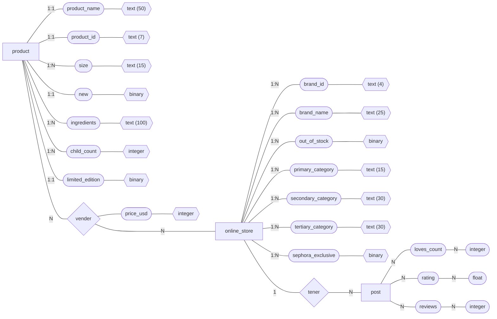

# Modelo entidad-relación
Se representa en un diagrama el modelo entidad-relación de la base de datos de la tarea 1

```mermaid
flowchart LR
    product -- 1:1 --- product_name([product_name])
    product -- 1:1 --- product_id([product_id])
    product -- 1:N --- size([size])
    product -- 1:1 --- new([new])
    product -- 1:N --- ingredients([ingredients])
    product -- 1:N --- child_count([child_count])
    product -- 1:1 --- limited_edition([limited_edition])

    product_name --- texto1{{"text (50)"}}
    product_id --- texto2{{"text (7)"}}
    size --- texto3{{"text (15)"}}
    new --- texto4{{binary}}
    ingredients --- texto5{{"text (100)"}}
    child_count --- texto6{{integer}}
    limited_edition --- texto7{{binary}}

    online_store -- 1:N --- brand_id([brand_id])
    online_store -- 1:N --- brand_name([brand_name])
    online_store -- 1:N --- out_of_stock([out_of_stock])
    online_store -- 1:N --- primary_category([primary_category])
    online_store -- 1:N --- secondary_category([secondary_category])
    online_store -- 1:N --- tertiary_category([tertiary_category])
    online_store -- 1:N --- sephora_exclusive([sephora_exclusive])

    brand_id --- texto8{{"text (4)"}}
    brand_name --- texto9{{"text (25)"}}
    out_of_stock --- texto10{{binary}}
    primary_category --- texto11{{"text (15)"}}
    secondary_category --- texto12{{"text (30)"}}
    tertiary_category --- texto13{{"text (30)"}}
    sephora_exclusive --- texto14{{binary}}

    post -- N --- loves_count([loves_count])
    post -- N --- rating([rating])
    post -- N --- reviews([reviews])

    loves_count -- N --- texto15([integer])
    rating -- N --- texto16([float])
    reviews -- N --- texto17([integer])

    product -- N --- relacion1{vender} -- N ----- online_store
    online_store -- 1 --- relacion2{tener} -- N --- post

    relacion1 --- price_usd([price_usd])
    price_usd --- texto18{{integer}}
```