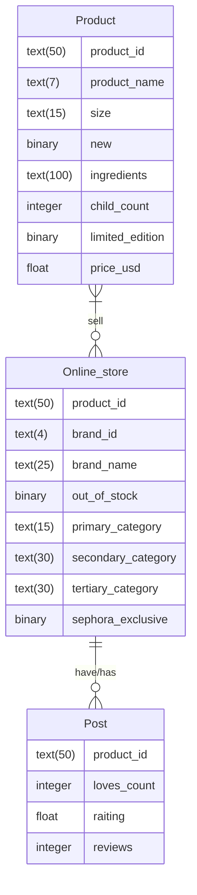

# Esquema del modelo relacional

Product(product_id, product_name, size, new, ingredients, child_count, limited_edition, price_usd)

Online_Store(brand_id, product_id, brand_name, out_of_stock, primary_category, secondary_category, tertiary_category, sephora_exclusive)

Post(product_id, loves_count, raiting, reviews)

# Diagrama relacional

# Operadores del álgebra relacional

### Ver qué tipo de nmarcas se venden en Sephora
Ver el nombre de las marcas que hay en la tienda en línea.

$\Pi _{\mbox[brand_name]}\left(\mbox[Online_Store]\right)$

### Ver el nombre de los productos que no se tienen en stock
Selecciona de la tabla online_store todo los que no se tenga en stock, de esa tabla lo que nos importa es el product_id. Ahora quiero obtener el nombre de los productos y para eso necesito la tabla Product, entonces busco que el product_id sea igual que el product_id de la selección de la primera composición. Buscamos el nombre de los productos de cada product_id y lo extraemos.

$$\Pi$$Product.product_name[$$\sigma$$Product.product_id = $$\Pi$$product_id($$\sigma$$Online_Store.out_of_stock=1(Online_Store)).product_id(Product $$x$$ Online_Store)]

### Cuántos productos tienen más reacciones
Ponemos un threshold de cual es el mínimo de reacciones que tenga un producto y filtramos

$$\sigma$$loves_count>=500(post)

### Qué productos son edición límitada y cuestan más de $100USD
Hacemos la selección de lo que queremos, en este caso que sea edición limitada y que cueste más de 100 dólares y después pedimos que extraiga el nombre del producto de la tabla de Product

$$\Pi$$product_name [$$\sigma$$limited_edition=1, $$\sigma$$price_usd>100] (Product)