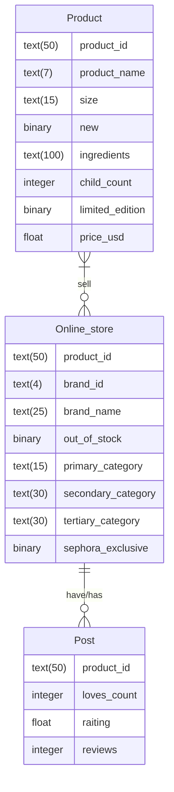

# Esquema del modelo relacional

Product(product_id, product_name, size, new, ingredients, child_count, limited_edition, price_usd)
Online_Store(brand_id, brand_name, out_of_stock, primary_category, secondary_category, tertiary_category, sephora_exclusive)
Post(loves_count, raiting, reviews)

# Diagrama relacional

# Operadores del álgebra relacional

\Pi