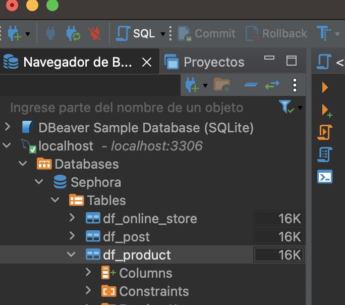

Se tenía una base de datos en un mismo archivo, se envió la base de datos a python y desde Python se trabajó en deshacer la base y crear diferentes tablas de acuerdo a nuestras necesidades. Se crearon 3 tablas, una para le producto, una para la tienda online y otra para las reacciones.

Se encontró que no fue tan sencillo subir la base de datos a DBeaver, ya que hay veces que se tienen más caracteres de los que se habían identificado desde el principio, entonces algo que yo revisaría antes sería encontrar el string con un mayor número de caracteres para que desde un principio se puedan declarar bien las variables.
Tener todos los datos en una misma tabla y tener que separarlo en distintas tablas se vuelve complejo al momento de mantener las llaves primarias.

Al revisar las tareas de mis compañeros, me di cuenta que debería de hacer más bonita mi portada de github y a veces siento que mi lógica me lleva a facilitarme la vida a comparación de lo que ellos hacen, me pongo un 8.

